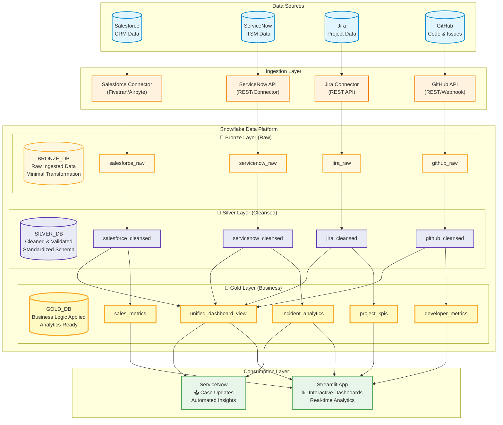

# Data Platform Architecture Diagram

## Overview
This diagram illustrates the end-to-end data flow from multiple source systems (Salesforce, ServiceNow, Jira, GitHub) through Snowflake's medallion architecture (Bronze → Silver → Gold) to downstream consumption via Streamlit dashboards and ServiceNow integration.

## Architecture Diagram

## Layer Descriptions

### 🥉 Bronze Layer (Raw Data)
- **Purpose**: Store raw, unmodified data from source systems
- **Characteristics**: 
  - Exact copy of source data
  - Minimal to no transformation
  - Preserves data lineage
  - Supports data reprocessing

### 🥈 Silver Layer (Cleansed Data)
- **Purpose**: Clean, validate, and standardize data
- **Characteristics**:
  - Data quality checks applied
  - Standardized schemas
  - Deduplicated records
  - Null handling and type conversions

### 🥇 Gold Layer (Business-Ready Data)
- **Purpose**: Apply business logic and create analytics-ready datasets
- **Characteristics**:
  - Business metrics calculated
  - Data aggregated and enriched
  - Optimized for query performance
  - Ready for consumption by BI tools

## Data Flow Summary

1. **Ingestion**: Data extracted from Salesforce, ServiceNow, Jira, and GitHub using connectors/APIs
2. **Bronze**: Raw data lands in Snowflake with minimal transformation
3. **Silver**: Data cleansed, validated, and standardized
4. **Gold**: Business logic applied, metrics calculated, unified views created
5. **Consumption**: 
   - Streamlit dashboards consume Gold layer for interactive analytics
   - ServiceNow receives automated insights and updates from Gold layer

## Technologies

- **Data Sources**: Salesforce, ServiceNow, Jira, GitHub
- **Ingestion**: REST APIs, Webhooks, ETL Connectors (Fivetran/Airbyte)
- **Data Warehouse**: Snowflake
- **Visualization**: Streamlit
- **Automation**: ServiceNow API for write-back

